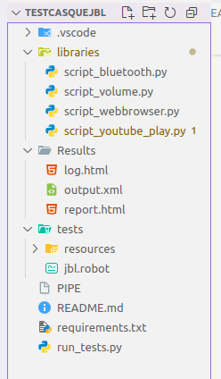
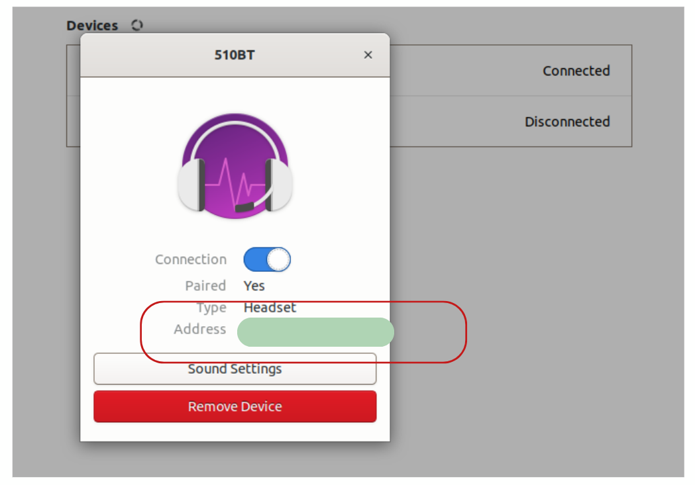
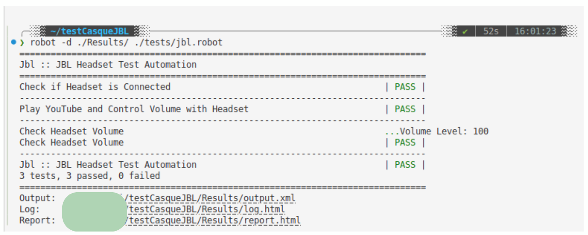

## 🎧 🤖 🐍 💻 ☕
## JBL Headset Automation Testing

This project automates testing for a JBL Bluetooth headset using **Python** and **Robot Framework**. It verifies Bluetooth connectivity, plays a YouTube video, and controls system volume dynamically to simulate real-world usage.

---

## 🚀 Features

- ✅ Check if the headset is connected via Bluetooth
- 📺 Play a YouTube video automatically
- 🔊 Dynamically increase the system volume step-by-step
- 📉 Read and validate current volume level
- 📄 Generate test reports (HTML/XML)

---

## 🧩 Project Structure


---

## ⚙️ Requirements

- Python 3.8+
- Robot Framework
- Playwright
- PulseAudio (for volume control, Linux only)
- A Bluetooth headset (JBL or any compatible)

---

## 📦 Installation

1. **Clone the repo**
```bash
git clone https://github.com/SalhiFayza/JBL_Robot_FrameWork_Python.git
cd JBL_Robot_FrameWork_Python
```

2. **Install dependencies**
```bash
pip install -r requirements.txt
playwright install
```

3. **Turn on and connect your Bluetooth headset (e.g., JBL)**

4. **Update your JBL MAC address**
Open the file ```resources/variables.robot``` and replace the default MAC address with your headset's:
```
${MAC}           37:2B:54:9C:75:C4
```
---

## ▶️ Running the Tests

You can run the tests in two ways:

### 1. Using Python runner:

```bash
python run_tests.py
```

### 2. Using Robot Framework directly:

```bash
robot jbl.robot
or
robot -d ./Results/ ./tests/jbl.robot
```

Test results will be available in:

- `output.xml` – test execution log
- `log.html` – detailed log with steps
- `report.html` – summary report

---

## 🧪 Example Test Case

- Check if headset is connected
- Open YouTube
- Simulate increasing volume from 0% to 100%
- Log the current volume
- Fail if volume is not detected

---
## 🥇 Volume Control Logic – Explained
```
 current_volume = 0
    set_volume(current_volume)
    time.sleep(3)

    while current_volume < 100:
        current_volume += 10
        set_volume(min(current_volume, 100))
        time.sleep(4)

    time.sleep(3)
    browser.close()
```
This code starts by setting the system volume to 0%, then gradually increases it by 10% every 4 seconds until it reaches 100%. It uses small delays to simulate natural volume changes while a YouTube video plays, then closes the browser at the end.


---

## 💡 Notes

- Works best on Linux (uses `pactl` and `bluetoothctl`)
- You must pair your headset before running tests
- The test will open a Chromium browser window (Playwright)

---

## 📬 Contact

Made by Salhi Fayza  
---

## 📄 License

MIT License – Free to use and modify
